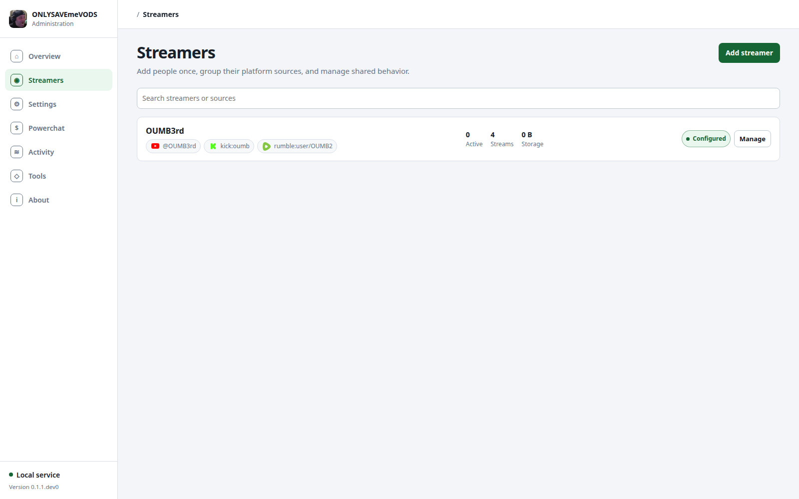
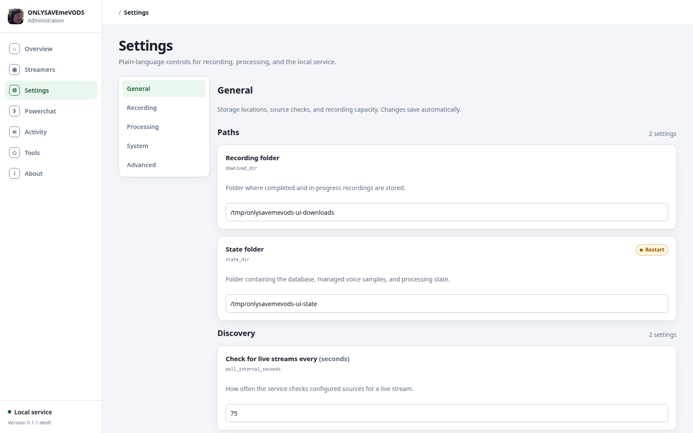
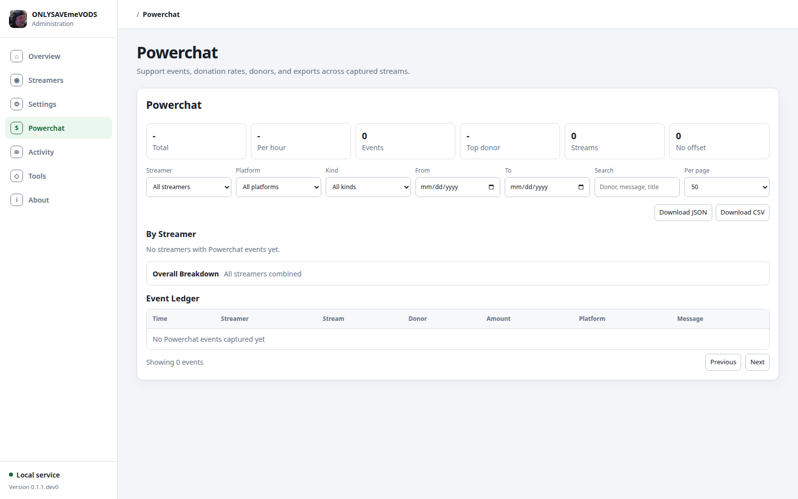

# ONLYSAVEmeVODS

ONLYSAVEmeVODS watches streamer sources and starts `yt-dlp` for every live
stream it finds. YouTube keeps the existing fast channel discovery, while
Twitch, Kick, and Rumble are probed conservatively through yt-dlp and recorded
only when the source is currently live. It supports multiple simultaneous
streams from the same streamer and treats a `yt-dlp` exit as uncertain until the
source has been checked for the configured post-exit window.

## Quick Start

```bash
python3 -m venv .venv
.venv/bin/python -m pip install -e .
cp config.example.toml config.toml
```

Edit `config.toml`, then run a one-shot check:

```bash
.venv/bin/onlysavemevods check --config config.toml
```

For a streamer with multiple sources, group them in `config.toml` so shared
settings only need to be maintained once:

```toml
[streamers."OUMB3rd"]
sources = [
  "@OUMB3rd",
  "https://www.youtube.com/@OUMB3rdVODS",
  "twitch:OUMB3rd",
  "kick:OUMB3rd",
  "https://rumble.com/user/OUMB3rd",
]
download_dir_name = "OUMB3rd"
powerchat_enabled = true
powerchat_username = "OUMB3rd"

[streamers."OUMB3rd".voice_detection]
mode = "fixed"
speakers = 2

[streamers."OUMB3rd".speaker_labels]
SPEAKER_00 = "OUMB3rd"
SPEAKER_01 = "Guest"
```

The top-level `channels = [...]` list still works for simple setups, but the
dashboard treats it as ungrouped sources. Source inputs can be existing YouTube
handles or URLs, explicit shorthands such as `twitch:name`, `kick:name`, and
`rumble:user/name`, or full URLs for supported platforms.

Run continuously:

```bash
.venv/bin/onlysavemevods run --config config.toml
```

The daemon also starts a local dashboard when `web_enabled = true`. It shows
streamer cards with grouped sources, storage totals, attention signals, current
segment files, per-stream file/log/job tabs, and dashboard-triggered processing
work with phase and progress. Each streamer card has Settings and Voices actions
for shared source settings, voice detection, known voice samples, and speaker
attribution review. The About tab shows the app version and runtime details, and
the Config tab can save app settings back to `config.toml` while keeping
sensitive yt-dlp arguments redacted. Bind address and port changes are saved for
the next restart. The Powerchat tab summarizes captured support events by
streamer, stream, donor, and stream-relative hour, and each stream card has a
matching Powerchat tab for that stream only. Finalized media files and sidecars
such as live chat, subtitles, and Powerchat events can be downloaded from the
dashboard:

```text
http://127.0.0.1:8080/
http://127.0.0.1:8080/status.json
```

To run only the status page against an existing state database:

```bash
.venv/bin/onlysavemevods web --config config.toml
```

## Using the Web Dashboard

Open the dashboard in a browser. On the machine running the service, the default
URL is:

```text
http://127.0.0.1:8080/
```

From another machine on the same network, use the server's IP address and the
configured `web_port`, for example:

```text
http://192.168.10.220:8080/
```

The dashboard is currently a trusted local admin interface. Do not expose it to
the public internet without putting authentication or a private network/VPN in
front of it.

### Streamers Tab



The Streamers tab is the main working view. A streamer is the shared identity
for one person or group, and it can contain several platform sources such as a
YouTube handle, a Twitch channel, a Kick channel, and a Rumble user page.

Use it for day-to-day operations:

1. Click **Add Streamer** to open the setup wizard.
2. Enter the streamer name. This is also the default folder name used under
   `download_dir` unless you set a custom download directory name.
3. Add one or more sources. You can paste a full URL such as
   `https://kick.com/oumb`, `https://www.twitch.tv/name`, or
   `https://rumble.com/user/name`, and the UI will normalize it to the matching
   source shorthand where possible.
4. Optionally set voice detection and speaker names in the wizard.
5. Save the streamer. The running service reloads the saved config where it can.

Configured source examples:

```text
@SomeYouTubeHandle
https://www.youtube.com/@SomeYouTubeVODs
twitch:somechannel
kick:somechannel
rumble:user/someuser
```

If old top-level `channels = [...]` entries exist, the dashboard shows them as
**Needs Grouping**. They are still monitored, but you should create a streamer
for them so settings, voices, Powerchat, and source lists are managed in one
place.

Each streamer card can be expanded or collapsed. Use the card buttons for:

- **Settings**: edit streamer name, download directory name, sources, shared
  transcription/voice settings, content event rules, and Powerchat settings.
- **Voices**: manage known voice profiles, upload voice samples, create samples
  from diarized transcript speakers, and review match suggestions.
- **Streams**: browse recorded and active streams for that streamer. Use the
  platform, title search, date range, and pagination controls when a streamer has
  many streams.

Each stream has its own tabs:

- **Files** lists finalized media and sidecars, with actions such as Download,
  Transcribe/Retranscribe, Render chat, Refresh chat, Watermark, and Delete copy
  where available.
- **Content Events** shows detected stream moments from configured audio/keyword
  rules.
- **Powerchat** shows donations/gifts for that stream only, including donations
  per hour, top donors, an event ledger, and JSON/CSV downloads.
- **Detected Speakers** loads diarized transcript speakers for that stream so
  they can be used as voice samples.
- **Jobs** shows active/recent processing jobs for the stream.
- **Stream Log** shows newest-first operational events for that stream.

### Config Tab



The Config tab edits app-wide settings in `config.toml`. Click **Save App
Settings** after changing fields. Most runtime settings are reloaded by the
daemon, but web bind address and port changes require a service restart.

Useful settings to start with:

- `channels`: legacy/simple source list. Prefer Streamers for new setups.
- `download_dir` and `state_dir`: where media and app state are stored.
- `poll_interval_seconds`: how often sources are checked.
- `max_concurrent_downloads`: live downloads allowed at once.
- `record_live_chat`: records YouTube live chat sidecars.
- `render_live_chat_video`: creates separate `- chat.mp4` videos after capture.
- `transcribe_subtitles`: runs WhisperX after finalized media.
- `voice_match_enabled`: enables sample-backed voice attribution.
- `stream_event_detection_enabled`: enables content-event detection after
  finalize/transcription.
- `watermark_enabled`: enables per-recipient watermark copy creation.
- `log_level`: set to `DEBUG` when diagnosing discovery, downloads, or web
  slowness.

The Config tab also includes sections for speaker labels and content event
rules. Speaker labels are manual mappings such as `SPEAKER_00 = "Host"`; they
override automatic voice matches. Content event rules define what moments should
be flagged using a mix of audio labels, transcript keywords, loudness, duration,
severity, and optional voice matching.

### Powerchat Tab



The top-level Powerchat tab aggregates every captured Powerchat event across all
streams. Enable Powerchat per streamer first by setting `powerchat_enabled =
true` and `powerchat_username = "name"` in the streamer Settings panel or in
`config.toml`.

The dashboard shows:

- total money by currency, kept separate from unit gifts such as Kick gifts;
- normalized donation rate, for example `USD 322.00 over 1.8h = USD 183.62/hr`;
- per-streamer cards with stream totals, donations per hour, and top donors;
- an optional **Overall Breakdown** for all streamers combined;
- a searchable/filterable event ledger.

Use the filters for streamer, platform/payment source, event kind, date range,
and donor/message/title search. The **Download JSON** and **Download CSV** links
respect the current filters. Streamer cards and individual stream Powerchat tabs
also provide scoped JSON/CSV downloads.

Direct export URLs are also available:

```text
/powerchat-events?format=json
/powerchat-events?format=csv
/powerchat-events?format=csv&streamer=OUMB3rd
/powerchat-events?format=csv&video_id=kick:oumb
```

Captured raw sidecars are written beside finalized media as
`<media>.powerchat-events.json`. These raw sidecars are downloadable from the
stream Files tab.

### Jobs And Logs

The global Jobs tab shows active/recent work across the whole app. Streamer
cards and stream cards also show jobs scoped to that streamer or stream. Jobs
are ordered by start time so running items do not jump around. Chat render jobs
show structured progress when the isolated renderer reports it, including phase,
elapsed time, target output, and current temporary output size.

Use stream logs when you need to understand what happened to a specific stream:
segment switches, yt-dlp exits, post-exit checks, finalization, retries, chat
refresh, and Powerchat listener messages are recorded there. Use systemd logs
for service-wide diagnostics:

```bash
journalctl -u onlysavemevods.service -f
```

For web performance issues, set `log_level = "DEBUG"`, restart the service, and
look for `Slow web ...` warnings in the journal. Large stream folders with many
fragments can slow dashboard scans; use **Clean fragments** on ended streams
when the fragments are no longer needed for resume/debugging.

### Common Tasks

Add a new streamer:

1. Open **Streamers**.
2. Click **Add Streamer**.
3. Enter a streamer name and sources.
4. Optionally configure voice detection and speaker names.
5. Save the wizard.

Add or remove a source for an existing streamer:

1. Open the streamer card.
2. Click **Settings**.
3. Use **Add Source** to paste a URL or choose a supported platform.
4. Save the source. Source URL inputs are normalized to shorthand values when
   possible, such as `kick:oumb`.

Manually add or redownload a VOD:

1. Use the streamer card VOD form to add a new VOD URL, or open a stream and use
   **Redownload from VOD**.
2. YouTube VOD downloads try to fetch live chat replay when available.
3. Kick VOD downloads try to fetch chat replay best-effort.
4. Post-processing jobs that are enabled for live downloads, such as
   transcription, content events, chat render, and voice matching, are queued for
   VOD downloads too.

Create a chat video:

1. Enable `record_live_chat = true` for YouTube live chat capture.
2. Enable `render_live_chat_video = true` for automatic post-stream chat videos,
   or click **Render chat** / **Regenerate chat video** from the Files tab.
3. Watch the Jobs tab for render progress. The output is a separate
   `Title [VIDEOID] - chat.mp4`; the original media is not modified.

Transcribe and attribute speakers:

1. Enable `transcribe_subtitles = true` or click **Transcribe** on a finalized
   media file.
2. Use **Detected Speakers** on a stream to inspect diarized labels.
3. Use the streamer **Voices** button to add known voice profiles and upload or
   create samples.
4. Manual speaker labels in the Config tab or streamer Settings win over
   automatic voice matches.

Configure content events:

1. Enable `stream_event_detection_enabled = true`.
2. Install the optional dependency with `.[stream-events]` if the installer has
   not already done it.
3. Add content event rules in the Config tab or streamer Settings.
4. Use labels, keywords, loudness, duration bounds, severity, and optional voice
   criteria to define what should be detected.
5. Events appear on each stream's **Content Events** tab and can be regenerated
   from the Files tab.

Create and manage watermarked copies:

1. Enable `watermark_enabled = true` and make sure the watermark secret
   environment variable is configured.
2. On a finalized media or chat video file, enter a recipient label and click
   **Watermark**.
3. Watermarked copies are separate files under `.watermarks/` and can be
   downloaded or deleted from the Files tab.
4. Use the Watermark Detection panel to upload a suspect clip and identify the
   matching recipient/copy.

Delete or clean up a stream:

1. Use **Clean fragments** on ended streams to remove saved `.part-Frag` files.
2. Use **Delete stream** to remove the stream record and downloaded stream
   folder. The UI asks for confirmation because this cannot be undone.
3. Active/downloading streams cannot be deleted or cleaned up until they are no
   longer in a resume-sensitive state.

## Systemd

Install and enable the system service:

```bash
scripts/install-systemd.sh
```

The distro-named entrypoints have the same functionality and delegate to the
same shared systemd installer:

```bash
scripts/install-almalinux.sh
scripts/install-debian.sh
scripts/install-ubuntu.sh
```

The installer enables and restarts `onlysavemevods.service`, so rerunning it after an
update makes systemd pick up the newly installed code. It also appends any
missing top-level settings from the current `config.example.toml` to an existing
`config.toml` without overwriting your configured values.

By default the systemd installer deploys to `/opt/onlysavemevods`, creates a dedicated
`onlysavemevods` system user, and runs the service as that user instead of as root or
your login account. The application code, venv, and Deno runtime are root-owned;
only `config.toml`, `downloads/`, `state/`, and `.cache/` are writable by the
service user so the web UI can save settings without making app code writable.

The generic installer auto-detects `dnf` or `apt-get` for OS dependencies. On
Debian/Ubuntu systems, it uses `apt-get` to install systemd, curl, certificates,
unzip, DejaVu fonts, Python 3.11+ with venv support, FFmpeg, and
Tesseract OCR for Twitch ad repair; the Ubuntu script also enables the
`universe` repository when available for FFmpeg. On
AlmaLinux/RHEL-like systems, the installer uses `dnf` where possible, including
Python 3.11+, FFmpeg, Tesseract OCR, DejaVu Sans fonts, EPEL, and RPM Fusion.

For NVIDIA/NVENC, the AlmaLinux/RHEL path can install RPM Fusion NVIDIA
driver/CUDA runtime packages (`akmod-nvidia` and
`xorg-x11-drv-nvidia-cuda`) when needed. The Debian/Ubuntu path does not install
NVIDIA drivers automatically; install the distro-recommended NVIDIA driver and
encode packages yourself if you want NVENC chat rendering. If FFmpeg already
advertises NVENC encoders, the installer leaves the driver stack unchanged.

The installer installs `yt-dlp[default]` into the project venv, so a system
`yt-dlp` package is not required. It also installs a project-local Deno runtime
under `.deno/` because yt-dlp's current YouTube support uses EJS challenge
solver scripts with an external JavaScript runtime. If `transcribe_subtitles =
true` is set in `config.toml`, the installer also installs `whisperx` into the
project venv. Set `ONLYSAVEMEVODS_INSTALL_WHISPERX=1` to force that install or
`ONLYSAVEMEVODS_INSTALL_WHISPERX=0` to skip it. If `voice_match_enabled = true`,
the installer also installs the `onlysavemevods[voice-match]` extra for
pyannote-backed known-voice matching. That extra pins the shared Torch and
Hugging Face packages and uses pyannote.audio 4.x to match the WhisperX-compatible
stack. Set
`ONLYSAVEMEVODS_INSTALL_VOICE_MATCH=1` to force it or
`ONLYSAVEMEVODS_INSTALL_VOICE_MATCH=0` to skip it.
If `stream_event_detection_enabled = true`, the installer also installs the
`onlysavemevods[stream-events]` extra for Hugging Face AudioSet content event
detection. Set `ONLYSAVEMEVODS_INSTALL_STREAM_EVENTS=1` to force it or
`ONLYSAVEMEVODS_INSTALL_STREAM_EVENTS=0` to skip it. The installer runs
`pip check` before restarting the service so resolver conflicts fail loudly.

The installer also enables a nightly root-run Python dependency updater. It
refreshes the project venv, `yt-dlp[default]`, installed/enabled WhisperX, and
installed/enabled voice-match dependencies, but skips the run if the service is
recording, checking a recent exit, waiting
to retry, or running queued dashboard/watermark jobs. By default it runs at
`04:15` with up to `45m` randomized delay. If the service is active but the
local status endpoint cannot be read, the updater skips that run rather than
guessing. Disable or reschedule it at install time with:

```bash
ONLYSAVEMEVODS_ENABLE_PYTHON_UPDATER=0 scripts/install-systemd.sh
ONLYSAVEMEVODS_PYTHON_UPDATE_CALENDAR='*-*-* 03:30:00' scripts/install-systemd.sh
ONLYSAVEMEVODS_PYTHON_UPDATE_RANDOM_DELAY=20m scripts/install-systemd.sh
```

The installer also enables a GitHub Release app updater. It checks
`FlaminWrap/ONLYSAVEmeVODS` release tarballs, verifies the `.sha256` checksum,
and applies updates only when the service is idle. Configure behavior in
`config.toml` with `app_update_mode`:

- `disabled`: no checks or install controls.
- `manual`: the About tab checks and installs only when you click the buttons.
- `check_only`: scheduled/manual checks report newer releases but never install.
- `auto_install`: scheduled checks request newer releases and install them when
  idle.

Manual install requests are written under `state/app-update-request.json`; the
web process does not replace root-owned app files itself. The systemd app
updater applies the request, backs up the current app directory, restores it if
the update fails, and preserves config, secrets, downloads, state, venv, Deno,
and cache directories. Its default timer runs at `05:15` with up to `45m`
randomized delay. Reschedule it at install time with:

```bash
ONLYSAVEMEVODS_APP_UPDATE_CALENDAR='*-*-* 05:30:00' scripts/install-systemd.sh
ONLYSAVEMEVODS_APP_UPDATE_RANDOM_DELAY=20m scripts/install-systemd.sh
```

To install somewhere other than `/opt/onlysavemevods`:

```bash
ONLYSAVEMEVODS_INSTALL_DIR=/srv/onlysavemevods scripts/install-systemd.sh
```

To skip OS package installation and only use what is already present:

```bash
ONLYSAVEMEVODS_SKIP_OS_DEPS=1 scripts/install-systemd.sh
```

To install OS packages but skip NVIDIA driver/NVENC package installation:

```bash
ONLYSAVEMEVODS_SKIP_NVIDIA_DEPS=1 scripts/install-systemd.sh
```

To skip Deno installation because you already provide a supported runtime on
`PATH`:

```bash
ONLYSAVEMEVODS_SKIP_DENO=1 scripts/install-systemd.sh
```

To install WhisperX even before transcription is enabled in `config.toml`:

```bash
ONLYSAVEMEVODS_INSTALL_WHISPERX=1 scripts/install-systemd.sh
```

To install voice matching even before `voice_match_enabled = true` is present in
`config.toml`:

```bash
ONLYSAVEMEVODS_INSTALL_VOICE_MATCH=1 scripts/install-systemd.sh
```

To update a config file manually without changing existing values:

```bash
.venv/bin/onlysavemevods update-config --config config.toml --defaults config.example.toml
```

Inspect it:

```bash
sudo systemctl status onlysavemevods.service
systemctl list-timers onlysavemevods-python-update.timer
systemctl list-timers onlysavemevods-app-update.timer
journalctl -u onlysavemevods.service -f
journalctl -u onlysavemevods-python-update.service
journalctl -u onlysavemevods-app-update.service
```

Set `log_level = "DEBUG"` in `config.toml` and restart the service when you need
more detail about source discovery, post-exit probes, resume decisions, and
finalization.

On the default config, the status page is available on the host at
`http://127.0.0.1:8080/`.

Uninstall the service without deleting config, state, or downloads:

```bash
scripts/uninstall-systemd.sh
```

## Notes

- Public YouTube, Twitch, Kick, and Rumble livestream sources are supported; no
  cookies are configured by default.
- Logging defaults to `INFO`. Set `log_level = "DEBUG"` in `config.toml`, or add
  `-v` when running the CLI manually, for verbose diagnostics.
- Dashboard downloads are limited to finalized files for streams already present
  in the state database, plus finalized live chat and subtitle sidecars.
  `.part`, fragment, and `.ytdl` files are not served.
- YouTube discovery checks each source's `/live` page first, then scans up to
  `channel_scan_limit` recent stream entries with up to
  `discovery_probe_concurrency` yt-dlp probes at once. Twitch, Kick, and Rumble
  v1 discovery probes the configured source URL and starts a download only when
  yt-dlp reports it as live.
- New downloads are stored under `download_dir/<streamer-or-source>/<video_id>/`. Existing
  in-progress `download_dir/<video_id>/` folders are reused so resumable partials
  are not abandoned after an update.
- Active and resumable files use stable `segment-001.*` names. When a stream is
  finally marked ended, finalized segment files are renamed to the video title
  and ID, for example `Live Title [VIDEOID].mp4`. If a continuation file is
  needed, it uses `Live Title [VIDEOID] - part 002`.
- Downloads use `--continue`, `--part`, `--keep-fragments`, and `--no-playlist`
  by default. YouTube downloads also use `--live-from-start` when
  `live_from_start = true`; other platforms are left to yt-dlp's platform
  behavior. Keeping fragments costs extra disk space while a segment is active,
  but it gives the bot enough state to resume a format that yt-dlp accidentally
  finalized.
- Set `record_live_chat = true` to ask yt-dlp to write YouTube live chat with
  `--write-subs --sub-langs live_chat`. The bot keeps it as a sidecar
  `.live_chat.json` file and renames it with the finalized stream title and ID
  when the stream is marked ended. Chat is recorded by a separate yt-dlp sidecar
  process so the main download can start video/audio immediately instead of
  waiting behind live chat fragments. When live chat is enabled and no custom
  format is configured, the media process also passes
  `--format bestvideo*+bestaudio/best` so media download remains explicit.
  Chat recording, refresh, and rendered chat videos are currently YouTube-only;
  non-YouTube sources are recorded as video/audio only in this first adapter
  pass.
- Twitch ad repair is enabled by default with `twitch_ad_repair_enabled = true`.
  After a Twitch stream is finalized, the bot OCR-scans the configured early
  window for Twitch's "Commercial break in progress" slate. If it can find a
  recent Twitch VOD covering that time, it downloads the matching slice, aligns
  it against the captured video, and writes a separate `.repaired.mp4` copy plus
  a `.twitch-ad-repair.json` sidecar. Originals are left untouched. Set
  `twitch_ad_repair_scan_seconds = 0` to scan the whole file, or set
  `twitch_ad_repair_enabled = false` to disable the automatic job.
- Powerchat support-event listening is a streamer setting. Enable
  `powerchat_enabled = true` and set `powerchat_username` on the streamer card
  or in `[streamers."Name"]` to listen to both Powerchat websocket feeds while
  that streamer is being recorded. Captured rows are written beside the media as
  `<media>.powerchat-events.json`, shown on the stream Powerchat tab, and tallied
  as separate money totals and platform-unit totals such as Kick gifts. This is a
  best-effort unofficial integration, so unknown payloads are preserved in the
  sidecar for later parser fixes but are not counted. The top-level Powerchat
  dashboard has per-streamer cards, an overall breakdown, donations per hour,
  top donors, a searchable ledger, and filtered JSON/CSV export links. Streamer
  cards and individual stream Powerchat tabs also provide scoped JSON/CSV
  downloads. Raw `.powerchat-events.json` sidecars are downloadable from the
  stream file list, and the export endpoint is available directly as
  `/powerchat-events?format=json` or `/powerchat-events?format=csv` with optional
  filters such as `streamer=`, `video_id=`, `platform=`, `kind=`, `from=`, `to=`,
  and `search=`.
- Set `render_live_chat_video = true` to also create a separate
  `Title [VIDEOID] - chat.mp4` after the stream ends. The original finalized
  media file is left untouched; the chat version is re-encoded with the video on
  the left and a rendered chat panel on the right. New chat messages appear at
  the bottom, older messages move upward, and messages leave only when pushed
  off the panel by newer chat. Emoji images referenced by the live chat JSON are
  cached locally and rendered into the panel when available. This option implies
  live chat recording. Set `chat_render_panel_workers` to control Python/Pillow
  panel frame workers: `0` uses all CPU cores, `1` renders serially, and higher
  values use that exact worker count. Set `chat_render_timeout_seconds` to
  raise the one-hour render timeout for very long VODs, or `0` to disable that
  timeout. Set `chat_render_use_nvenc = true` to use
  NVIDIA NVENC for the FFmpeg chat video encode/merge stages. Leave
  `chat_render_nvenc_devices = []` to use FFmpeg's default GPU, set
  `chat_render_nvenc_devices = ["0"]` to pick one GPU, or set
  `chat_render_nvenc_devices = ["0", "1"]` to rotate chat renders across
  multiple GPUs. The systemd installer can install NVIDIA/NVENC packages on
  supported DNF systems when NVIDIA PCI hardware is detected. At runtime,
  ONLYSAVEmeVODS only detects NVIDIA GPUs and FFmpeg NVENC support and logs what it
  finds.
- Set `transcribe_subtitles = true` to run WhisperX after each stream is
  finalized. It writes speech subtitle/transcript sidecars next to the media
  file: `.srt`, `.vtt`, `.txt`, `.tsv`, and `.json`. The systemd installer
  installs WhisperX automatically when this setting is enabled; for manual
  installs, install it in the runtime environment and set `whisperx_path` if it
  is not on `PATH`. The defaults target an NVIDIA GPU
  with `whisperx_device = "cuda"`, `whisperx_model = "large-v3"`, and
  `whisperx_compute_type = "float16"`. Leave
  `transcription_max_concurrent = 1` for a single GPU. The systemd service
  stores Hugging Face, NLTK, and Matplotlib runtime caches under
  `/opt/onlysavemevods/.cache`.
- Most app settings can be changed from the dashboard Config tab and are
  written back to `config.toml`. The Streamers tab can add, update, or delete
  grouped sources, and each streamer card keeps shared settings behind its
  Settings button. The running process reloads the saved values where possible;
  web bind address and port changes apply after restart.
- Voice detection for transcription is managed with WhisperX/pyannote
  diarization. Use the dashboard Config tab to update the default mode, use a
  streamer card's Settings button for shared streamer overrides, or use
  `onlysavemevods voice-detection show --config config.toml` and
  `onlysavemevods voice-detection set --config config.toml --mode auto` from the
  CLI. Modes are `off` for no speaker labels, `auto` to let WhisperX infer the
  count, `range` with `--min-speakers` and/or `--max-speakers`, and `fixed` with
  `--speakers N`. Streamer defaults are stored under
  `[streamers."Name".voice_detection]`; source-specific overrides can still be
  stored as `[channel_voice_detection."Channel Name"]` tables and take
  precedence. Diarization usually needs a Hugging Face token with the relevant
  pyannote model terms accepted; set the token in the environment variable named
  by `whisperx_hf_token_env` (`HF_TOKEN` by default).
- The dashboard has a Voices button on configured streamer cards. It manages
  `[streamers."Name".voices."Voice Name"]` profiles, uploaded samples under
  `state/voice_samples/<streamer>/<voice>/`, samples made from existing diarized
  transcript segments, and review of low-confidence matches. The systemd installer
  installs the optional matcher dependency when `voice_match_enabled = true`; for
  manual installs, use `.venv/bin/python -m pip install -e ".[voice-match]"`.
  If pip has already upgraded Torch, `huggingface-hub`, or pyannote packages too
  far, rerun that command so the WhisperX-compatible pins can repair them. When available, the matcher
  writes `<media>.voice-attribution.json` after WhisperX, auto-applies confident
  matches to `.srt`/`.vtt`, and leaves weak matches for review. Manual
  `[streamers."Name".speaker_labels]` and `[channel_speaker_labels."Channel Name"]`
  mappings still win because WhisperX `SPEAKER_00` IDs are per transcript.
- Content event detection can be enabled from the Config tab. It writes
  `<media>.stream-events.json`, adds an Events tab to each stream, and can match
  AudioSet labels such as laughter/cheering/applause plus transcript keywords.
  For manual installs, use `.venv/bin/python -m pip install -e ".[stream-events]"`.
- The dashboard Config tab also has a Speaker Names section. After WhisperX has
  produced a diarized `.json` sidecar, the dashboard lists detected labels such
  as `SPEAKER_00` and `SPEAKER_01` per streamer first, with source-specific
  overrides available for advanced cases. Save names there to write manual
  speaker-label mappings into `config.toml`; existing `.srt` and `.vtt` subtitles
  for that group are rewritten with names such as `Host: ...` or `Guest: ...`.
- The dashboard shows `Transcribe` for finalized media without subtitles and
  `Retranscribe` when `.srt`/`.vtt` sidecars already exist. Retranscription
  replaces only the WhisperX subtitle/transcript sidecars for that media file.
- Set `watermark_enabled = true` to enable private, per-recipient invisible
  video watermark copies from the dashboard. Originals are left untouched.
  Before queueing or detecting copies, set the environment variable named by
  `watermark_secret_env` (default `ONLYSAVEMEVODS_WATERMARK_SECRET`) to a long random
  secret and keep it with your backups; detection requires both the secret and
  the SQLite copy records. One easy way to generate one is:

  ```bash
  export ONLYSAVEMEVODS_WATERMARK_SECRET="$(openssl rand -base64 48)"
  ```

  The systemd installer creates `${ONLYSAVEMEVODS_INSTALL_DIR:-/opt/onlysavemevods}/secrets.env`
  with a generated `ONLYSAVEMEVODS_WATERMARK_SECRET` if that file does not already
  exist, and the service loads it with `EnvironmentFile`. Back up this file with
  `config.toml` and `state/onlysavemevods.sqlite3`; losing the secret means old
  watermark copies cannot be detected. To create or rotate it manually, put the
  generated value in that persistent environment file:

  ```ini
  ONLYSAVEMEVODS_WATERMARK_SECRET=replace-with-the-generated-secret
  ```

  Watermarked copies are written below each stream
  folder in `.watermarks/` and are served through a separate dashboard link.
  The detector is available from the dashboard and as
  `.venv/bin/onlysavemevods detect-watermark --config config.toml --media suspect.mp4`.
  Use a video slice when possible: 30-120 seconds is best, 10-30 seconds is
  usually enough, and screenshots are not supported for confident attribution.
- Planned reconnects are disabled by default with `reconnect_interval_seconds =
  0`. Set it above `0` only if you also want periodic forced reconnects after
  yt-dlp progress shows all active format downloads have caught up to the live
  edge. Planned reconnects terminate yt-dlp without graceful finalization,
  leaving `.part` files in place for `--continue`.
- Once the post-exit checks decide a stream has ended, leftover `.part` format
  files are finalized with FFmpeg and temporary `.ytdl`/fragment files are
  removed.
- If YouTube reports the video as private, removed, deleted, or otherwise
  terminally unavailable during a post-exit check, the bot stops checking and
  marks the stream ended immediately.
- If one format, such as audio, reaches the live edge and finalizes before the
  other format, a watchdog cuts that mixed segment quickly. When kept fragments
  are available, the bot turns finalized format files back into resumable
  `.part` files and restarts the same segment with `--live-from-start` instead
  of jumping to the live edge. If exact restore is not possible, continuation
  segments also use `--live-from-start` to prefer duplicates over missing
  content. Once the stream is truly ended, mixed leftovers are muxed to the
  shortest track.
- `-k` is not used by default. Add it to `extra_yt_dlp_args` only if you want
  to debug or keep post-processing intermediates.
- `extra_yt_dlp_args` cannot include metadata-only or download-suppression flags
  such as `--skip-download`, `--simulate`, or `--dump-json`; those belong only
  in the bot's internal probe commands.
- Active live downloads do not use `--download-archive`; SQLite state prevents
  duplicate active processes without accidentally blocking a false-exit restart.
- The systemd installer only removes/replaces the root-owned app copy during
  updates; uninstalling the service leaves config, downloads, state, venv, Deno,
  and the `onlysavemevods` user in place.
